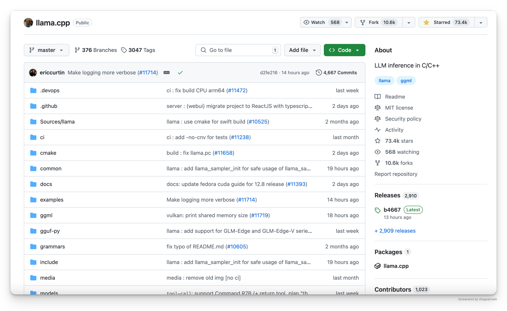
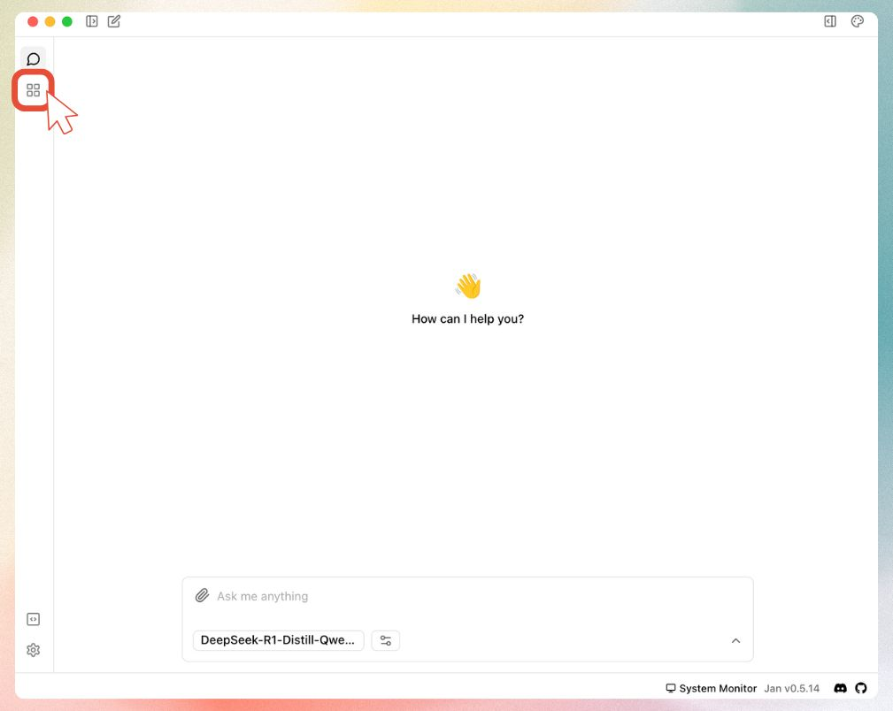
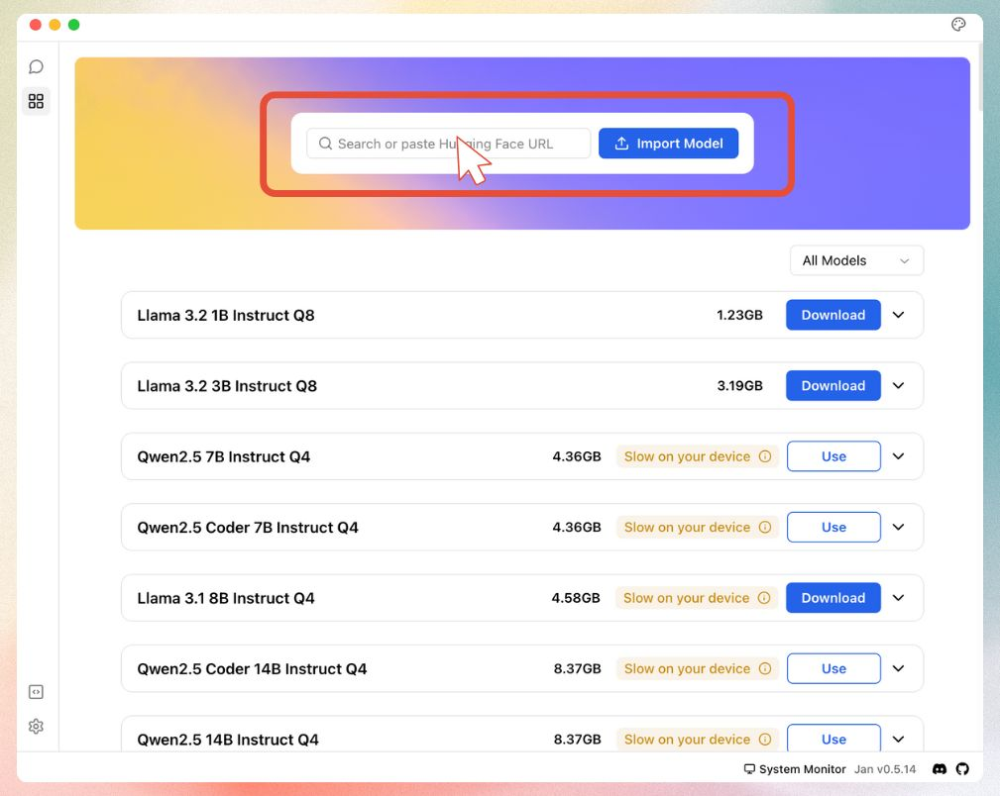

import { Callout } from 'nextra/components'
import CTABlog from '@/components/Blog/CTA'

# How to run AI models locally as a beginner?

Most people think running AI models locally is complicated. It's not. Anyone can run powerful AI models like DeepSeek, Llama, and Mistral on their own computer. This guide will show you how, even if you've never written a line of code.

## Quick steps:
### 1. Download [Hanzo AI](https://hanzo.ai)

*Download Hanzo AI from [hanzo.ai](https://hanzo.ai) - it's free and open source.*

### 2. Choose a model that fits your hardware

*Hanzo AI helps you pick the right AI model for your computer.*

### 3. Start using AI locally

That's all to run your first AI model locally!

*Hanzo AI's easy-to-use chat interface after installation.*

Keep reading to learn key terms of local AI and the things you should know before running AI models locally.

## How Local AI Works

Before diving into the details, let's understand how AI runs on your computer:

<Callout>
**Why do we need special tools for local AI?**
Think of AI models like compressed files - they need to be "unpacked" to work on your computer. Tools like llama.cpp do this job:
- They make AI models run efficiently on regular computers
- Convert complex AI math into something your computer understands
- Help run large AI models even with limited resources
</Callout>

*llama.cpp helps millions of people run AI locally on their computers.*

<Callout>
**What is GGUF and why do we need it?**

Original AI models are huge and complex - like trying to read a book in a language your computer doesn't understand. Here's where GGUF comes in:

1. **Problem it solves:**
   - Original AI models are too big (100s of GB)
   - They're designed for specialized AI computers
   - They use too much memory

2. **How GGUF helps:**
   - Converts models to a smaller size
   - Makes them work on regular computers
   - Keeps the AI smart while using less memory

When browsing models, you'll see "GGUF" in the name (like "DeepSeek-R1-GGUF"). Don't worry about finding them - Hanzo AI automatically shows you the right GGUF versions for your computer.
</Callout>

## Understanding AI Models

Think of AI models like apps on your computer - some are light and quick to use, while others are bigger but can do more things. When you're choosing an AI model to run on your computer, you'll see names like "Llama-3-8B" or "Mistral-7B". Let's break down what this means in simple terms.

<Callout>
The "B" in model names (like 7B) stands for "billion" - it's just telling you the size of the AI model. Just like how some apps take up more space on your computer, bigger AI models need more space on your computer.

- Smaller models (1-7B): Work great on most computers
- Bigger models (13B+): Need more powerful computers but can do more complex tasks
</Callout>

*Hanzo AI Hub makes it easy to understand different model sizes and versions*

**Good news:** Hanzo AI helps you pick the right model size for your computer automatically! You don't need to worry about the technical details - just choose a model that matches what Hanzo AI recommends for your computer.

## What You Can Do with Local AI

<Callout type="info">
Running AI locally gives you:
- Complete privacy - your data stays on your computer
- No internet needed - works offline
- Full control - you decide what models to use
- Free to use - no subscription fees
</Callout>

## Hardware Requirements

Before downloading an AI model, consider checking if your computer can run it. Here's a basic guide:

**The basics your computer needs:**
- A decent processor (CPU) - most computers from the last 5 years will work fine
- At least 8GB of RAM - 16GB or more is better
- Some free storage space - at least 5GB recommended

### What Models Can Your Computer Run?

| | | |
|---|---|---|
| Regular Laptop | 3B-7B models | Good for chatting and writing. Like having a helpful assistant |
| Gaming Laptop | 7B-13B models | More capable. Better at complex tasks like coding and analysis |
| Powerful Desktop | 13B+ models | Better performance. Great for professional work and advanced tasks |

<Callout type="info">
**Not Sure About Your Computer?**
Start with a smaller model (3B-7B) - Hanzo AI will help you choose one that works well on your system.
</Callout>

## Getting Started with Models

### Model Versions

When browsing models in Hanzo AI, you'll see terms like "Q4", "Q6", or "Q8". Here's what that means in simple terms:

<Callout>
These are different versions of the same AI model, just packaged differently to work better on different computers:

- **Q4 versions**: Like a "lite" version of an app - runs fast and works on most computers
- **Q6 versions**: The "standard" version - good balance of speed and quality
- **Q8 versions**: The "premium" version - highest quality but needs a more powerful computer
</Callout>

**Pro tip**: Start with Q4 versions - they work great for most people and run smoothly on regular computers!

### Getting Models from Hugging Face

You'll often see links to "Hugging Face" when downloading AI models. Think of Hugging Face as the "GitHub for AI" - it's where the AI community shares their models. Hanzo AI makes it super easy to use:

1. Hanzo AI has a built-in connection to Hugging Face
2. You can download models right from Hanzo AI's interface
3. No need to visit the Hugging Face website unless you want to explore more options

## Setting up your local AI

### Getting Models from Hugging Face

You'll often see links to "Hugging Face" when downloading AI models. Think of Hugging Face as the "GitHub for AI" - it's where the AI community shares their models. This sounds technical, but Hanzo AI makes it super easy to use:

1. Hanzo AI has a built-in connection to Hugging Face
2. You can download models right from Hanzo AI's interface
3. No need to visit the Hugging Face website unless you want to explore more options

<Callout>
**What powers local AI?**
Hanzo AI uses [llama.cpp](https://github.com/ggerganov/llama.cpp), an inference that makes AI models run efficiently on regular computers. It's like a translator that helps AI models speak your computer's language, making them run faster and use less memory.
</Callout>

### 1. Get Started
Download Hanzo AI from [hanzo.ai](https://hanzo.ai) - it sets everything up for you.

### 2. Get an AI Model

You can get models two ways:

#### 1. Use Hanzo AI Hub (Recommended):
   - Click "Download Model" in Hanzo AI
   - Pick a recommended model
   - Choose one that fits your computer

*Use Hanzo AI Hub to download AI models*

#### 2. Use Hugging Face:

<Callout type="warning">
Important: Only GGUF models will work with Hanzo AI. Make sure to use models that have "GGUF" in their name.
</Callout>

##### Step 1: Get the model link
Find and copy a GGUF model link from [Hugging Face](https://huggingface.co)

*Look for models with "GGUF" in their name*

##### Step 2: Open Hanzo AI
Launch Hanzo AI and go to the Models tab

*Navigate to the Models section in Hanzo AI*

##### Step 3: Add the model
Paste your Hugging Face link into Hanzo AI

*Paste your GGUF model link here*

##### Step 4: Download
Select your quantization and start the download

*Choose your preferred model size and download*

### Common Questions

**"My computer doesn't have a graphics card - can I still use AI?"**

Yes! It will run slower but still work. Start with 7B models.

**"Which model should I start with?"**

Try a 7B model first - it's the best balance of smart and fast.

**"Will it slow down my computer?"**

Only while you're using the AI. Close other big programs for better speed.

## Need help?
<Callout type="info">
[Join our Discord community](https://discord.gg/Exe46xPMbK) for support.
</Callout>